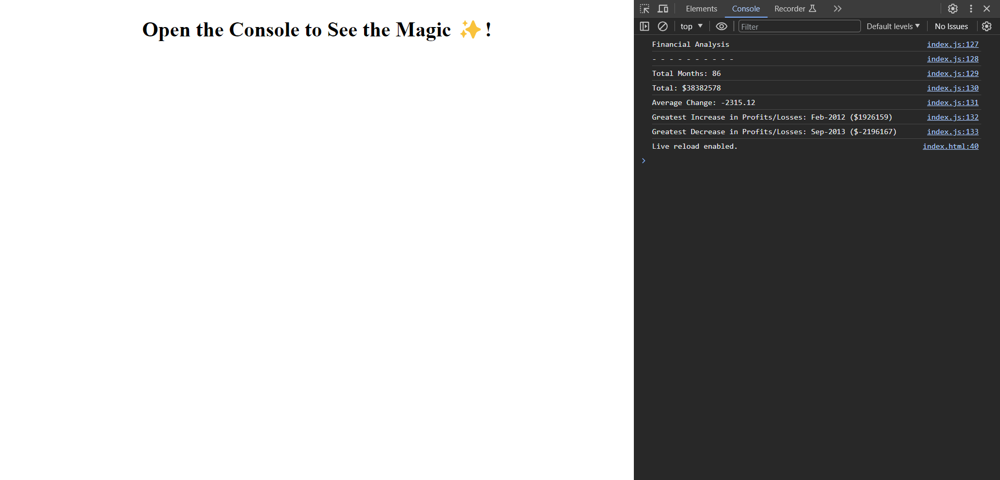

# <Console-Finances>

## Description
This project is aimed to analyze the financial records of a company given the dataset in the file. The analysis can be viewed by opening the console which should provide calculations of total months, the total amount of Profits/Losses, average change, and, the greatest increase and decrease in Profits/Losses.

## Usage

The image below shows the website when the console is opened. It provides all the aspects that were analyzed for the financial records of the company.

## Deployment
The deployed website is available at:

[Console Finances](https://cemileblks.github.io/console-finances/)

## License

This project is licensed under the MIT License. Please refer to the LICENSE in the repo.